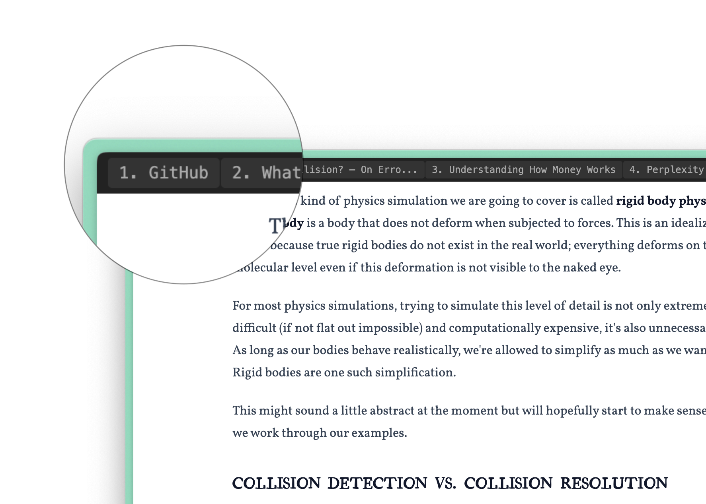

# Tab List for Arc

This is a Chrome/Arc Browser extension to display a persistent tab list on top of every page.

Why build this? Well, because I love the Arc Browser, but the absence of a horizontal tab list pissed me off.

I know, I'm gonna piss off a lot of Arc people with this extension, I know!!!

## How to use?

Go to chrome://extensions, enable the Developer mode and load this project's folder.

Also, you may want to remove all the "Go to Sidebar #" shortcuts of the Arc Browser, I don't know why Arc rendered all the tabs in a different order than what Chrome returned.

Oh, this reminded me of another thing I hate too: the tab creation order in Arc is crazy. I'm never able to guess where my next tab will land.

## Are you mad?

You too? Good.

## A good user will report bug instead of complain

I know, I'm not a good user, I'm a good developer.
